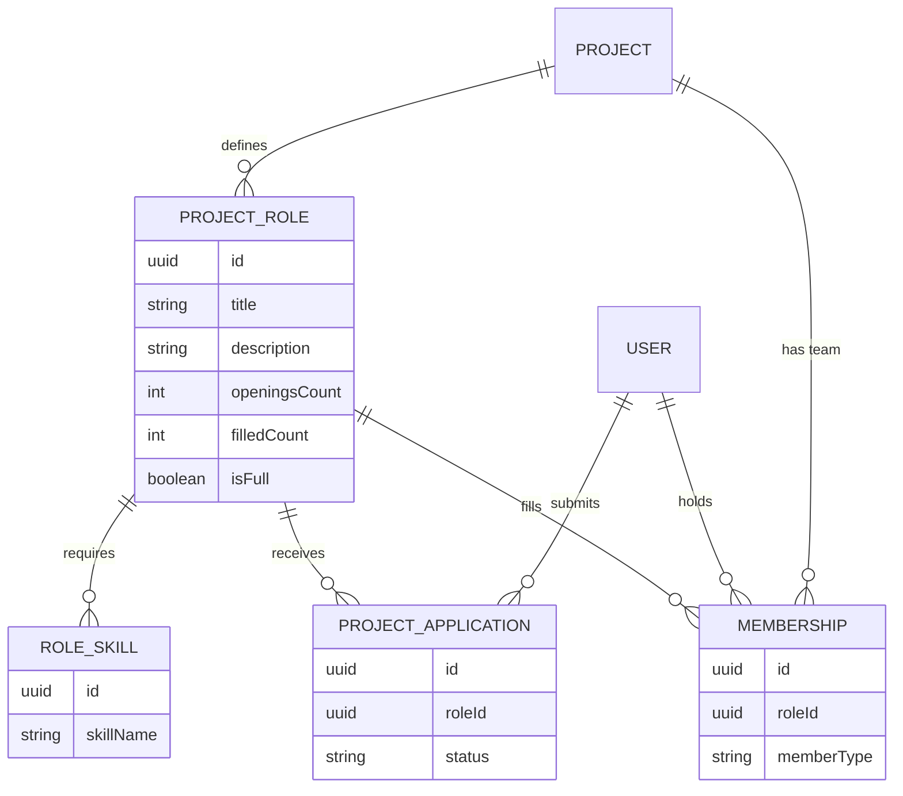
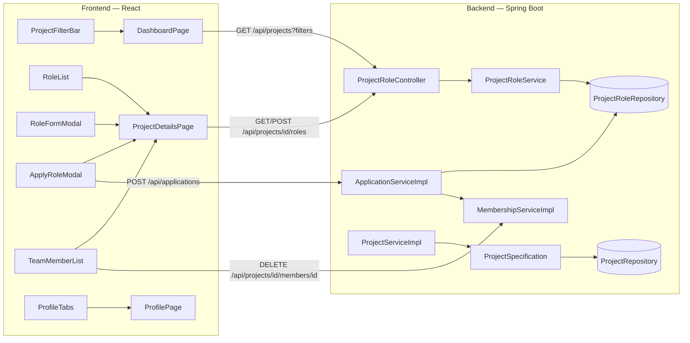
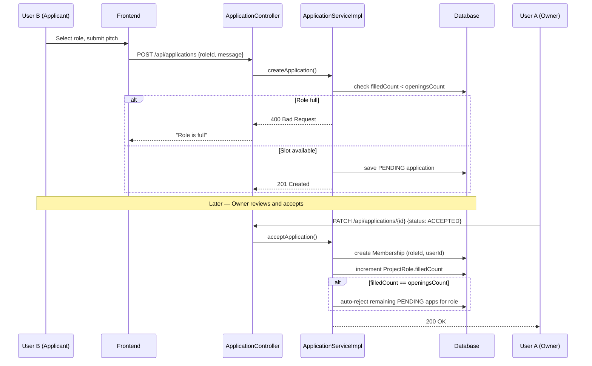
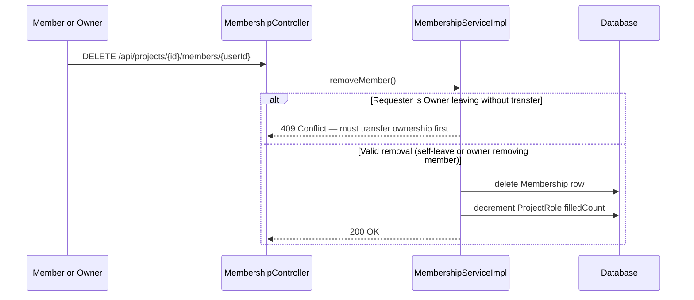
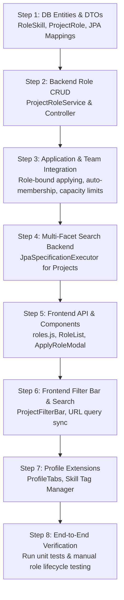

# CoBuild V1 Implementation Plan: Core Team & Roles Infrastructure

This document is the detailed technical plan for **V1** of CoBuild — converting generic project postings into a role-based team recruitment platform. It combines the resolved decisions, file-level changes, and build sequence with diagrams for each major flow, so the plan can be understood at a glance before diving into code.

---

## 1. Resolved Decisions

| # | Question | Decision |
|---|---|---|
| 1 | Auto-rejection on capacity | When `filled_count == openings_count` for a role, all remaining `PENDING` applications for that role auto-transition to `REJECTED`. |
| 2 | Skills search logic | Default to **any-match (OR)** — projects matching at least one requested skill are shown, with matches highlighted on the card. |
| 3 | Legacy application migration | Backfill existing MVP applications under an auto-generated `ProjectRole` titled `"General Contributor"` (`openings_count = 99`) so nothing breaks. |
| 4 | Capacity handling pre-`IN_PROGRESS` | Add a computed `isFull` boolean on `Project`/`ProjectRole` DTOs; UI disables "Apply" and shows a "Team Full" badge when true. |

---

## 2. Data Model

### 2.1 Entity Relationship Diagram



### 2.2 Key Relationships to Note
- A `ProjectRole` belongs to exactly one `Project`, and can have many `RoleSkill`, `ProjectApplication`, and `Membership` records.
- `ProjectApplication` and `Membership` both carry a `roleId` foreign key — this is the link that makes capacity counting and auto-membership possible.

---

## 3. System Architecture (New Modules)



This shows the new pieces on each side and how they connect: the frontend pages/components call the new role, application, and search endpoints, which are backed by the new `role` package and `ProjectSpecification` on the backend.

---

## 4. Directories & Files to Create

### Backend (Java / Spring Boot)
```text
backend/src/main/java/com/cobuild/backend/
├── role/                        [NEW PACKAGE] Domain package for ProjectRole & RoleSkill
│   └── dto/
│       ├── request/             [NEW] CreateRoleRequest, UpdateRoleRequest
│       └── response/            [NEW] ProjectRoleResponse
└── project/
    └── specification/           [NEW] JPA Specifications for multi-facet search
```

### Frontend (React + Vite)
```text
frontend/src/
├── api/
│   └── roles.js                 [NEW] getProjectRoles, createRole, updateRole, deleteRole
├── components/
│   ├── project/                 [NEW] ProjectFilterBar, RoleList, RoleFormModal
│   ├── application/             [NEW] ApplyRoleModal
│   ├── team/                    [NEW] TeamMemberList
│   └── profile/                 [NEW] ProfileTabs
```

### File Change Checklist

| File | Change |
|---|---|
| `RoleSkill.java` | **New** — `id`, `role`, `skillName` |
| `ProjectRole.java` | **New** — `id`, `project`, `title`, `description`, `openingsCount`, `filledCount`, `skills` |
| `ProjectRoleRepository.java` | **New** — JPA repo |
| `ProjectRoleService(Impl).java` | **New** — CRUD, capacity checks, skill binding |
| `ProjectRoleController.java` | **New** — `/api/projects/{projectId}/roles` |
| `CreateRoleRequest.java` / `UpdateRoleRequest.java` | **New** — request DTOs |
| `ProjectRoleResponse.java` | **New** — `id`, `title`, `description`, `openingsCount`, `filledCount`, `isFull`, `skills` |
| `ProjectSpecification.java` | **New** — dynamic filters by `search`, `domain`, `experienceLevel`, `skills`, `status` |
| `ProjectApplication.java` | Modify — add `@ManyToOne ProjectRole role` |
| `Membership.java` | Modify — add `@ManyToOne ProjectRole role` |
| `User.java` | Modify — ensure skills/bio/links accessible |
| `ApplicationRequest.java` | Modify — add `roleId` |
| `ApplicationResponse.java` | Modify — add role details |
| `ProjectResponse.java` | Modify — add `roles` list + `isFull` |
| `UserProfileResponse.java` | Modify — add `createdProjects`, `collaboratedProjects`, skills |
| `ApplicationServiceImpl.java` | Modify — bind `roleId`, enforce capacity, auto-create membership, auto-reject on full |
| `MembershipServiceImpl.java` | Modify — decrement `filledCount` on leave/remove, enforce owner-transfer rule |
| `ProjectServiceImpl.java` / `ProjectController.java` / `ProjectRepository.java` | Modify — wire in `ProjectSpecification`, extend `JpaSpecificationExecutor<Project>` |
| `projects.js` / `applications.js` | Modify — support new query params / `roleId` |
| `DashboardPage.jsx` | Modify — render `ProjectFilterBar`, sync URL params |
| `ProjectDetailsPage.jsx` | Modify — integrate `RoleList`, `RoleFormModal`, `ApplyRoleModal`, `TeamMemberList` |
| `CreateProjectPage.jsx` | Modify — define initial roles at creation |
| `ProfilePage.jsx` | Modify — integrate `ProfileTabs`, skill tags manager |

---

## 5. Core Flow: Applying to a Role → Becoming a Member



---

## 6. Core Flow: Leaving / Removing a Member



---

## 7. Step-by-Step Implementation Sequence



---

## 8. Verification Plan

### 8.1 Backend Integration Tests
- **`ProjectRoleServiceTest`** — create roles, update openings count, delete roles without applications.
- **`ApplicationServiceRoleTest`**:
  - Apply to a specific role.
  - Accept an application → `filledCount` increments by 1, applicant added to `Membership`.
  - Apply when `filledCount == openingsCount` → `400 Bad Request`.
  - Auto-rejection of pending applications when last slot is filled.
- **`ProjectSpecificationTest`** — combined filter parameters (e.g. `domain=WEB&skills=React,Tailwind&experienceLevel=INTERMEDIATE`).

### 8.2 Manual End-to-End Test Scenario
1. **User A (Owner)** creates project "AI Chatbot UI".
2. **User A** adds 2 roles: "Frontend Developer" (2 openings, React/Tailwind), "Backend Engineer" (1 opening, Spring Boot/Python).
3. **User B** searches "AI", filters by skill "React", opens the project, applies to "Frontend Developer".
4. **User A** accepts User B.
5. **Verify:** application status → `ACCEPTED`; role shows `1/2 filled`; User B appears in Team section with role "Frontend Developer"; User B's profile shows the project under "Collaborated Projects".
